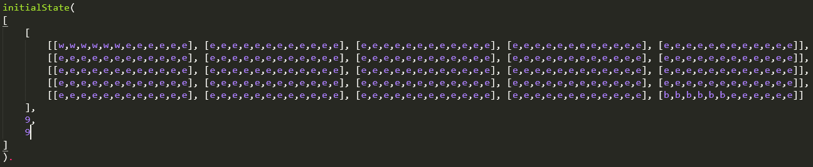
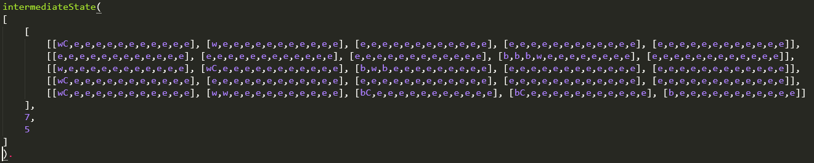
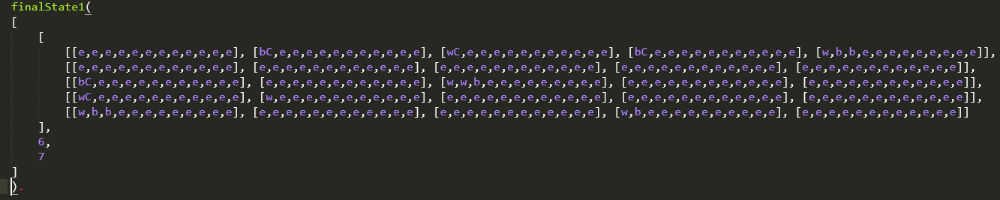
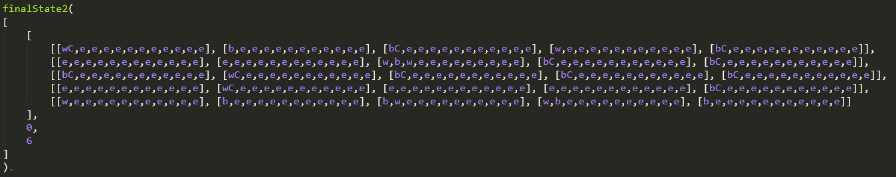
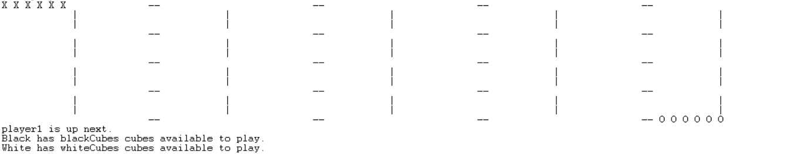

# Nava

Resolution proposal for the first project of the Logic Programming course unit @ FEUP, a game board called [**Nava**](https://boardgamegeek.com/boardgame/250491/nava)
[Official Board and Rules](https://drive.google.com/file/d/1qfZp_uDWRPxPU5U2lN-EGNDfEHkjha1u/view).

- [Nava](#nava)
  - [Who and What](#who-and-what)
  - [Game and Rules?](#game-and-rules?)
  - [Game State Representation](#game-state-representation)
  - [Visualization of the game state](#visualization-of-the-game-state)
  - [Documentation](#documentation)

___

## Who and What

- Prolog implementation of the NAVA board game
- identification of the group
  - Nava_2
  - Practical Class 3
  - Flávia Carvalho Gavinha Pereira Carvalhido - up201806857
  - Tomás Costa Fontes - up 

## Game and Rules?

- Nava is an abstract game, where players compete to be the first to lay all of their Cubes down on the board. They do this by moving Discs to capture rival pieces and lay Cubes to conquer junctions. 
- For 2 players, the game board is a 4x4 square and each player has 6 Discs and 9 Cubes each, starting with all their Discs stacked in opposite corners of the board. 
- Players take turns until someone captures all Disc stacks or lays all of their Cubes. If a player does that, they win and the other player loses. 
- A stack belongs to the player with their Disc at the top. 
- On their turn, a player must take a number of discs from the top of one of their stacks and move them, along a straight line, to another junction. The distance a stack moves is the same as the number of Discs in that stack, therefore, if a player takes a 2 disc stack, it can move 2 junctions. In a single move, stacks can't turn corners. 
- If a player moves their stack onto another stack it becomes theirs, including all opponents Discs in that stack. 
- Players can move all discs in stacks that they own, regardless of colour. 
- If their stack has more Discs than junctions available and they wish to move to the edge of the board, they must split their stack. 
- Furthermore, a player may choose to move a whole stack, (including captured opponents), or split their stack and move part of it. 
- If a player moves their entire stack off a junction, leaving it empty, then they place a Cube on this junction. 
- If a player lands on a Cube, they give the Cube back to the Cube’s owner and place their stack on this junction (this includes when a player lands on their own Cube). 
- When a player splits their stack, they may create an opponent-controlled stack in the process, as long as the top Disc from the resulting stack is from the opponent. 
- The first player with all their Cubes on the board or the last person in the game with Disc stacks is the winner!

- Biography:
  - Official Game Page: https://boardgamegeek.com/boardgame/250491/nava
  - Official Rule Sheet: https://drive.google.com/file/d/1qfZp_uDWRPxPU5U2lN-EGNDfEHkjha1u/view

## Game State Representation

The board contains 5 lines, with 5 playable cells in each line, making it a 5x5 matrix. However, because each cell can have multiple pieces in it, we decided to use a list of lists of lists, representing the rows, the cells in each row and the stack of pieces in each cell, respectively.
We also decided to represent each cell as a list with 12 elements, as pieces can stack up to that number on the same cell.

Each piece is represented using an atom, which is then translated to a specific character when the board is displayed. The pieces are encoded as follows:
| Piece      | atom | character       |
|:----------:|:----:|:---------------:|
| white Disc | w    | X               |
| black Disc | b    | O               |
| white Cube | wC   | &               |
| black Cube | bC   | I               |
| empty Cell | e    | whitespace(' ') |

The game state is represented by a list containing three elements, the board, the number of black cubes available to play and the number of white cubes available to play.

Below are some examples of the game state representation both as PROLOG code and as console output.

Initial state:

  

Intermediate state:

  

Final state:

  

  

## Visualization of the game state

The game state visualization on the SICSTUS console is as follows.

  

The initial game state is generated using the **_initial(-GameState)_** predicate, which calls the **_initialBoard(-Board)_** predicate to generate the initial board and then sets the number of black and white cubes to their respective values.
The visualization of the game state is executed using the **_displayGame(+GameState, +Player)_** predicate. This predicate calls **_displayBoard(+Board)_** to display the received board and displays the remaining information itself.
The **_displayBoard(+Board)_** predicate calls recursively some auxiliary predicates, like **_displayLine_**, **_displayCell_** and **_displayPiece_**, using them to recursively print the game board.

## Documentation

More info on Prolog documentation with PlDoc [here](https://www.swi-prolog.org/pldoc/doc_for?object=section(%27packages/pldoc.html%27)).
