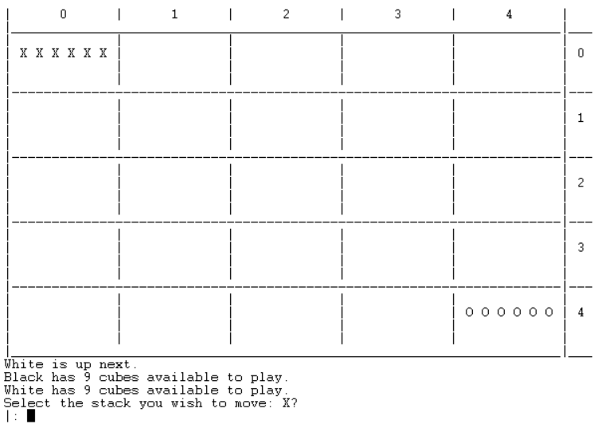
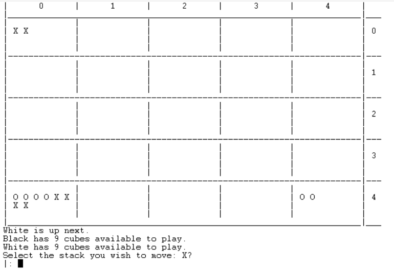
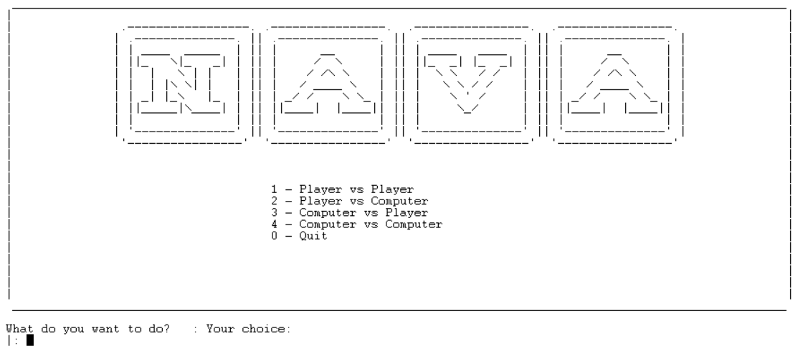
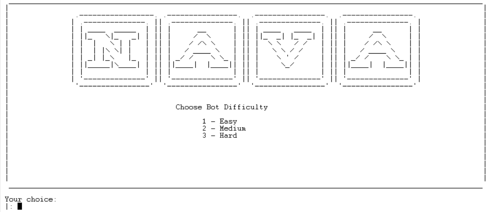
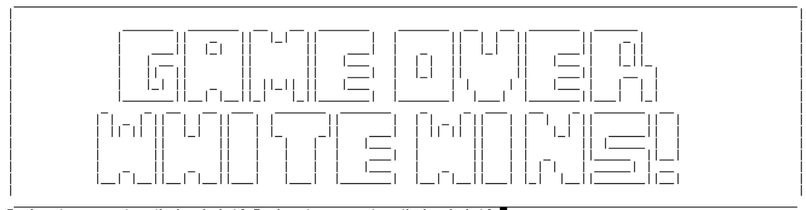
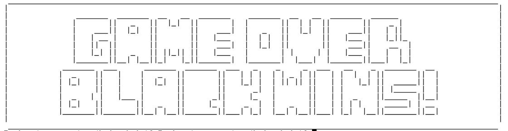

# Nava

Resolution proposal for the first project of the Logic Programming course unit @ FEUP, a game board called [**Nava**](https://boardgamegeek.com/boardgame/250491/nava)

[Official Board and Rules](https://drive.google.com/file/d/1qfZp_uDWRPxPU5U2lN-EGNDfEHkjha1u/view).

- [Nava](#nava)
  - [Who and What](#who-and-what)
  - [Game and Rules?](#game-and-rules?)
  - [Game State Representation](#game-state-representation)
  - [Visualization of the game state](#visualization-of-the-game-state)
  - [Documentation](#documentation)

___

## Who and What

- Prolog implementation of the NAVA board game
- identification of the group
  - Nava_2
  - Practical Class 3
  - Flávia Carvalho Gavinha Pereira Carvalhido - up201806857
  - Tomás Costa Fontes - up201806252

## Installation and Execution
- To play this game, the user must have SICStus Prolog 4.6 installed on their machine.
- After installing SICStus, if on Windows, the user must open the SICStus console and click on __File -> Consult...__ and choose the **game.pl** file from the source-code folder.
- If on Linux, the user must open a terminal window and start the sicstus console by typing **sicstus-4.6.0**. After that, the user should write **consult([path to the source code folder]/game.pl).**
- To start playing, it is necessary to write **play.** on the console, therefore calling the play/0 predicate, which starts the game.

## Game and Rules?

- Nava is a game where players compete to be the first to lay all their Cubes on the board. They do this by moving Discs to capture rival pieces and lay Cubes to conquer junctions. 
- For 2 players, the game board is a 4x4 square and each player has 6 Discs and 9 Cubes, starting with all their Discs stacked in opposite corners. 
- Players take turns until someone captures all Disc stacks or lays all their Cubes, therefore winning. 
- Stacks belong to the player with their Disc on top. 
- On their turn, players take a number of Discs from the top of one of their stacks and move them, along a straight line, to another junction. The distance stacks move matches the number of Discs in that stack. If players take a 2 disc stack, they move 2 junctions. 
- Stacks can't turn corners in single moves. 
- When players move their stack onto another stack it becomes theirs, including any opponent's Discs. 
- Players move all Discs in owned stacks, regardless of colour. 
- If their stack has more Discs than junctions available and they wish to move to the edge of the board, they must split their stack. 
- Furthermore, a player may choose to move a whole stack (including captured opponents), or split their stack and move part of it. 
- When players move their entire stack off junctions, emptying them, then they place a Cube on these junctions. 
- When players land on Cubes, they give the Cube back to the Cube’s owner and place their stack on this junction (even when they land on their own Cube). 
- When players split their stack, they may create an opponent-controlled stack, as long as the top Disc from the resulting stack is from the opponent. 
- First player with all Cubes on the board or the last in game with Disc stacks is the winner!

- Biography:
  - Official Game Page: https://boardgamegeek.com/boardgame/250491/nava
  - Official Rule Sheet: https://drive.google.com/file/d/1qfZp_uDWRPxPU5U2lN-EGNDfEHkjha1u/view

## Game Logic

### Game State Representation

The board contains 5 lines, with 5 playable cells in each line, making it a 5x5 matrix. However, because each cell can have multiple pieces in it, we decided to use a list of lists of lists, representing the rows, the cells in each row and the stack of pieces in each cell, respectively.
We also decided to represent each cell as a list with 12 elements, as pieces can stack up to that number on the same cell.

Each piece is represented using an atom, which is then translated to a specific character when the board is displayed. The pieces are encoded as follows:
| Piece      | atom | character       |
|:----------:|:----:|:---------------:|
| white Disc | w    | X               |
| black Disc | b    | O               |
| white Cube | wC   | &               |
| black Cube | bC   | I               |
| empty Cell | e    | whitespace(' ') |

The game state is represented by a list containing three elements, the board, the number of black cubes available to play and the number of white cubes available to play, respectively.

Below are some examples of the game state representation both as PROLOG code and as console output.

Initial state:

  

Intermediate state:

  

Final state:

  

  

### Visualization of the game state

The game state is initially generated by the **initial(-GameState)** predicate, and is then passed through the game loops where it is updated and rendered. The state is rendered using the **displayGame(+GameState, +Player)** predicate which uses some auxiliary predicates to print the board and also information regarding the number of cubes each player has got available to place.
The game state visualization on the SICSTUS console is as follows:
- Initial State

  

- Intermediate State

  

Even though the stacks are placed at the junctions in the real game, we chose to place them on actual square cell, as for better visualization and understanding of the board by the user.

The menus are generated by the predicates located in file **menus.pl**. Each menu predicate is responsible for displaying their respective menu's interface and handling user input. The input handling on the menus is done by the predicate **getInputAndValidate(+Low, +High, -Input)**, which asks the user for input and then checks if it is between Low and High.
The two most important menus are the following:
- Main Menu

  

- Choose Bot Difficulty Menu

  

When the game finishes, it is also displayed a message showing who was the winner, like the following:
- White Wins

  

- Black Wins

  

### Valid Moves List

In order to obtain a list with all possible moves for a given player, we need to know how to determine if a move is valid or not. This part of the logic is represented in the predicate validMove/2. A move, represented by a list containing the initial coordinates (X1, Y1) and the final coordinates(X2, Y2) is considered valid if the following conditions are met:
- Both the initial and final coordinates are valid coordinates (predicate validCoords/4).
- The player controls a stack located at the initial coordinates of the board (predicate getMatrixValue/4).
- The initial coordinates and the final coordinates are in the same row or column, as the game doesn't support diagonal or compound moves (predicate sameRowOrColumn/4).
- The player has enough pieces in the stack to move the amount of cells he wants to move, that is, because the player always has to move the same number of pieces as the number of cells he wants to move (if he wants to move 2 cells, then 2 pieces have to be moved), then the number of pieces in the player's stack has to be lower or equal than the distance between the initial and final coordinates (predicates getNumPiecesInCell/3 and getDistance/5).

If all these conditions are met, then the move (X1, Y1) -> (X2, Y2) is considered valid.
The predicates responsible for this part of the logic are the following:
- getAllValidMoves(+Board, -Moves, +Color) - iterates through all the possible pairs of coordinates to find valid moves.
- valid_moves(+GameState, +Player, -ListOfMoves) - calls the getAllValidMoves/3 predicate to get all valid moves for the received player.

### Move Execution

The predicate move/3 is the responsible to perform the move (X1,Y1) -> (X2,Y2) and consequently calculate the updated GameState and its different components. This predicate calls the auxiliary predicate movePieces/3 executes the stack move: checks the distance that the stack is moving, select the stack elements that need to move (distance = number of discs moving) and checks for the need to add a cube, which only happens when a stack moves out entirely from a junction. 

After executing movePieces, the NewBoard is already calculated and all there's left to calculate for the new GameState are the remaining cubes left to play for each player. Those are calculated by calling the predicate countCubesBoard/4 for each player, which returns the number of cubes placed in the new Board. The NewGameState is then formed by joining the new Board, white cubes and black cubes onto a list.

### Game Over

The game_over/2 predicate checks if some of the game over conditions is confirmed. There are two game over conditions:
- a player loses all their stacks and loses the game
- a player lays down all their cubes on the board, winning the game

The game_over/2 predicate makes use of two auxiliary predicates. The checkWinner/2 predicate which checks if the cubes from a given player are all placed down on the board allows us to check one of the game over conditions. Aditionally, the checkGameOver/2 predicate allows us to check if a given player has lost ownership of all their stacks, therefore checking the other game over condition. The game over message is written by these two auxiliary predicates, containing the identification of the game winner, which is also returned by the game_over/2 predicate when it succeeds.

### Board Evaluation
One very important part of the artificial intelligence in this game is the board evaluation, as that is what determines whether a move is good or not. This part of the logic is present in the predicate value/3.
In order to evaluate a certain game state, a mathematical formula was used. The formula was the following:
**Score = NumberOfPiecesFromThePlayer - NumberOfPiecesFromTheOpponent + NumberOfPlacedCubesFromThePlayer - NumberOfPlacedCubesFromTheOpponent**
All the formula values are calculated after the move has been simulated. Therefore, a move is better the higher it scores.
The predicates responsible for this part of the logic are the following:
- evaluateState(+GameState, +Color, -Score) - evaluates the game state based on the above mentioned formula.
- value(+GameState, +Player, -Value) - calls the evaluateState/3 predicate to evaluate the received game state.

### Computer's Move
When the computer is playing, there needs to be a way to determine which move it's going to make, and that is achieved using the predicate choose_move/4. On our implementation of the game, there are three levels of difficulty for the bots. The easy bot always performs a random move, the medium bot always performs a random move from the 5 moves with the highest score, and the hard bot always performs the best move.
The predicates responsible for this logic are the following:
- getAllValidMoves(+Board, -Moves, +Color) - Gets all the valid moves for a certain player
- sortMovesByScore(+Board, -SortedMoves, +Color) - Maps the moves to their respective score and sorts them based on it.
- getRandomMove(+Moves, -ChosenMove) - Returns a randomly chosen move from the moves list.
- getBestMove(+Moves, -ChosenMove) - Returns the move with the highest score from the moves list.

## Conclusion
This program was developed with a very hands-on approach, while learning to program in Prolog. While reflecting the learning process of this language, it may contain some unpolished code. 

The development of the game Nava in Prolog is, at first, somewhat of a challenge, but once one gets acquainted with the game rules and mechanics, it becomes easier to translate the game into code.

The main issue/limitation that can be found in the developed game is the lack of a quitting mid-game mechanic (i.e. quitting during a play or when playing). Other than that, every other feature is implemented and tested.

A proposed improvement point in the developed game would be to polish some implemented routines.

## Bibliography
The main sources used to research for information regarding prolog were the [SICStus manual](https://sicstus.sics.se/sicstus/docs/latest4/pdf/sicstus.pdf) and also the [SWI-Prolog documentation](https://www.swi-prolog.org/pldoc/doc_for?object=manual).

## Documentation

More info on Prolog documentation with PlDoc [here](https://www.swi-prolog.org/pldoc/doc_for?object=section(%27packages/pldoc.html%27)).
